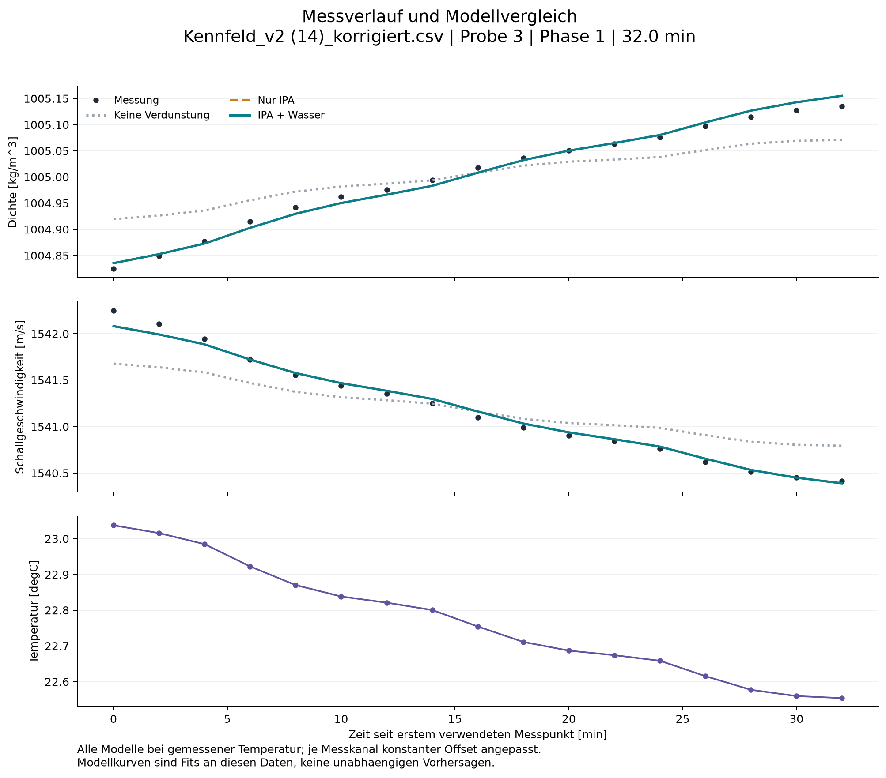
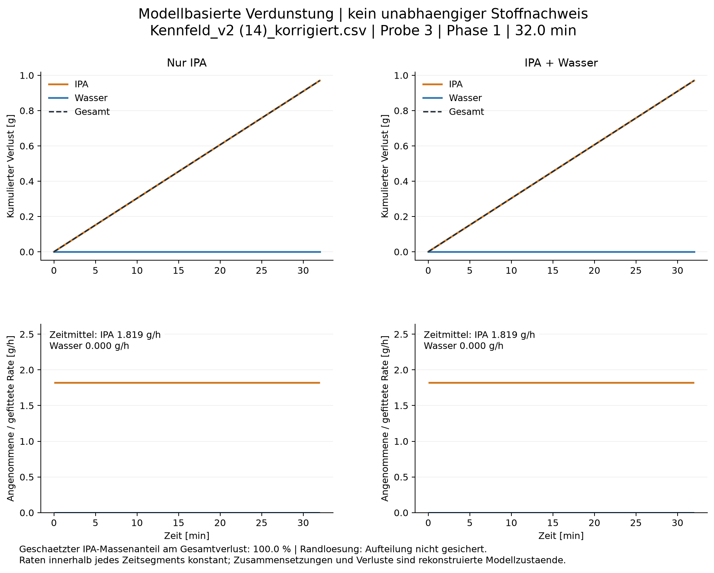
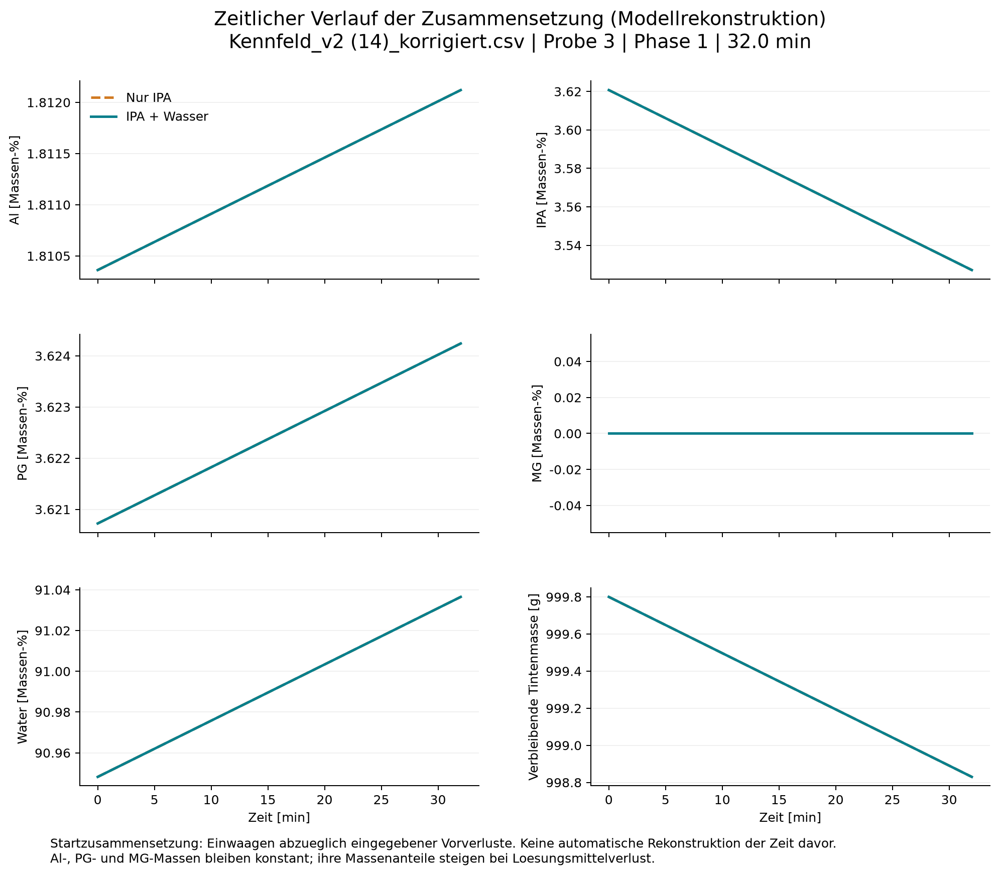
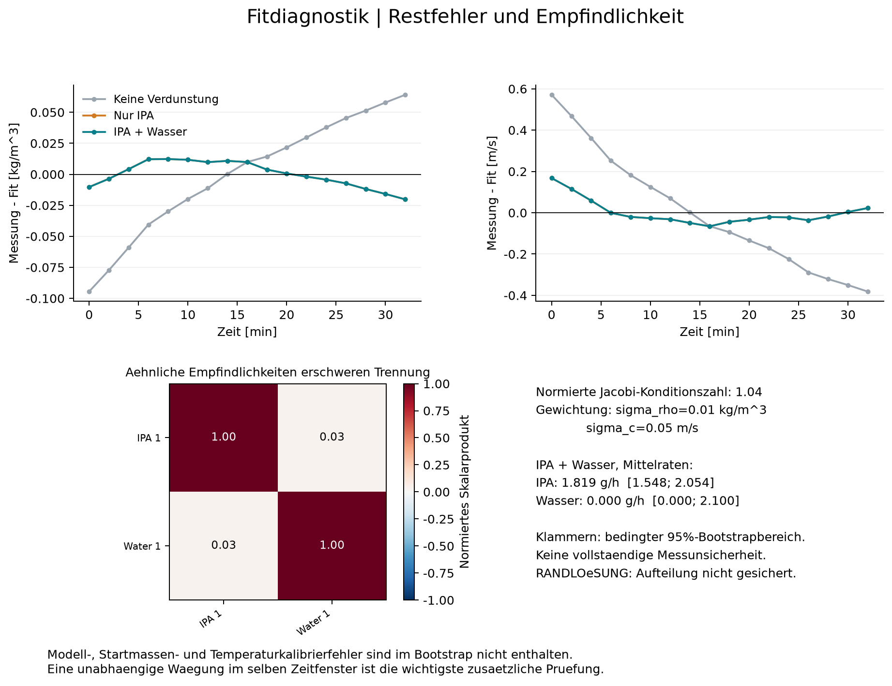

# Evaporation analysis

Source: Kennfeld_v2 (14)_korrigiert.csv
Sample: 3; phase: 1; duration: 32.00 min

| Model | IPA [g/h] | Water [g/h] | Total [g/h] | Density RMSE [kg/m^3] | Sound RMSE [m/s] |
|---|---:|---:|---:|---:|---:|
| none | 0.0000 | 0.0000 | 0.0000 | 0.0465 | 0.2829 |
| ipa | 1.8188 | 0.0000 | 1.8188 | 0.0102 | 0.0594 |
| mixed | 1.8188 | 0.0000 | 1.8188 | 0.0102 | 0.0594 |

## Interpretation and limitations

- Model-based estimates, not a direct measurement of vapour composition.
- Only losses after the first retained timestamp are fitted.
- Nominal additions minus entered prior losses define the starting composition.
- Al, PG and MG are assumed nonvolatile; no withdrawals, spills or unrecorded additions.
- A constant offset per sensor is fitted. Time-/composition-/temperature-dependent errors remain confounded.
- Bootstrap ranges are conditional on this calculator and the assumed initial composition.
- Stabil/Gueltig are not default filters because real evaporation itself can create a trend.
- Window shorter than one hour: small drifts and settling can dominate evaporation estimates.
- BOUNDARY SOLUTION: at least one mixed-model rate reaches zero/a limit; solvent split is not established.
- Unknown prior evaporation: zero prior losses were assumed for at least one solvent.
- WIDE RATIO RANGE: conditional 95% bootstrap range spans >50 percentage points.
- Few timestamps: bootstrap uncertainty and residual diagnostics have limited reliability.
- A better two-solvent fit alone is not proof that water evaporated: the model has extra free parameters.
- Calculator support: PG density: temperature 22.55 C is outside the locally supported temperature range.
- Calculator support: PG density: temperature 22.56 C is outside the locally supported temperature range.
- Calculator support: PG density: temperature 22.58 C is outside the locally supported temperature range.
- Calculator support: PG density: temperature 22.62 C is outside the locally supported temperature range.
- Calculator support: PG density: temperature 22.66 C is outside the locally supported temperature range.
- Calculator support: PG density: temperature 22.67 C is outside the locally supported temperature range.
- Calculator support: PG density: temperature 22.69 C is outside the locally supported temperature range.
- Calculator support: PG density: temperature 22.71 C is outside the locally supported temperature range.
- Calculator support: PG density: temperature 22.75 C is outside the locally supported temperature range.
- Calculator support: PG density: temperature 22.80 C is outside the locally supported temperature range.
- Calculator support: PG density: temperature 22.82 C is outside the locally supported temperature range.
- Calculator support: PG density: temperature 22.84 C is outside the locally supported temperature range.
- Calculator support: PG density: temperature 22.87 C is outside the locally supported temperature range.
- Calculator support: PG density: temperature 22.92 C is outside the locally supported temperature range.
- Calculator support: PG density: temperature 22.98 C is outside the locally supported temperature range.
- Calculator support: PG density: temperature 23.02 C is outside the locally supported temperature range.
- Calculator support: PG density: temperature 23.04 C is outside the locally supported temperature range.
- Calculator support: PG sound: temperature 22.6 C is outside locally supported anchors 25-65 C at 7.3 wt%.
- Calculator support: PG sound: temperature 22.6 C is outside locally supported anchors 25-65 C at 7.4 wt%.
- Calculator support: PG sound: temperature 22.7 C is outside locally supported anchors 25-65 C at 7.3 wt%.
- Calculator support: PG sound: temperature 22.7 C is outside locally supported anchors 25-65 C at 7.4 wt%.
- Calculator support: PG sound: temperature 22.8 C is outside locally supported anchors 25-65 C at 7.3 wt%.
- Calculator support: PG sound: temperature 22.8 C is outside locally supported anchors 25-65 C at 7.4 wt%.
- Calculator support: PG sound: temperature 22.9 C is outside locally supported anchors 25-65 C at 7.4 wt%.
- Calculator support: PG sound: temperature 23.0 C is outside locally supported anchors 25-65 C at 7.4 wt%.

The solvent ratio is a MASS ratio of the integrated inferred losses, not a volume or molar ratio.
All losses start at the first retained timestamp. Do not extrapolate them back before that point.
RMSE values refer to an in-sample fit with fitted channel offsets, not external validation.

