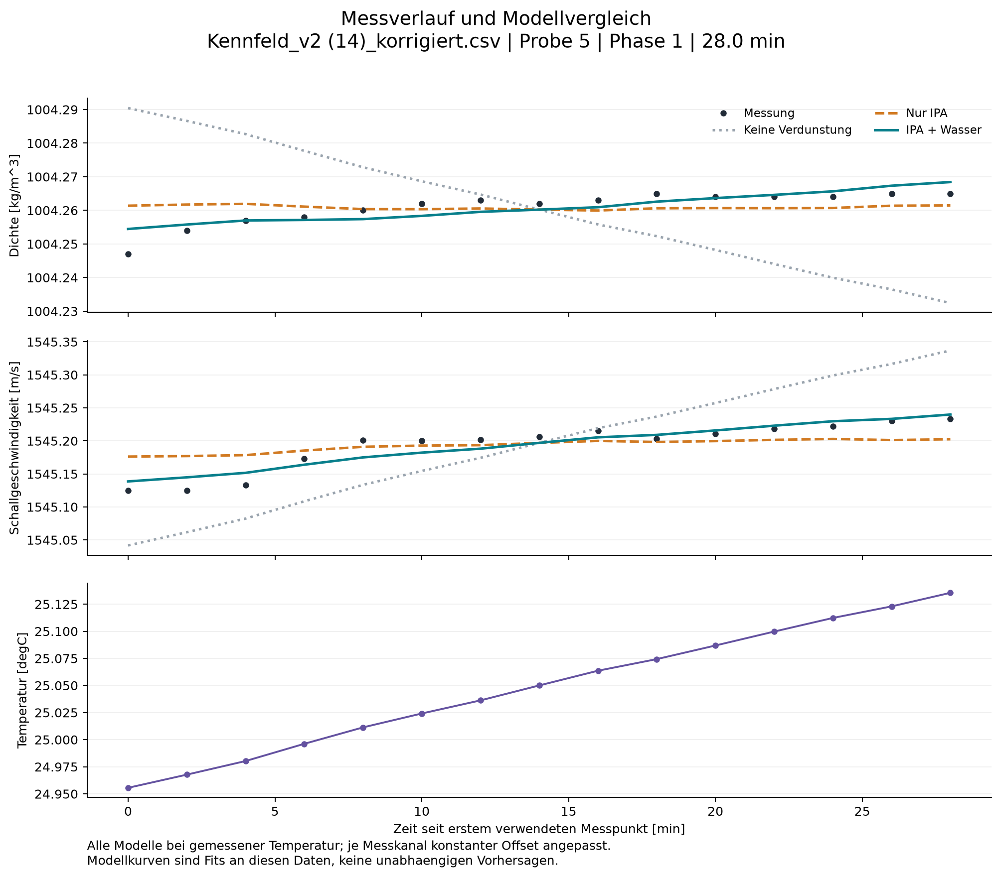
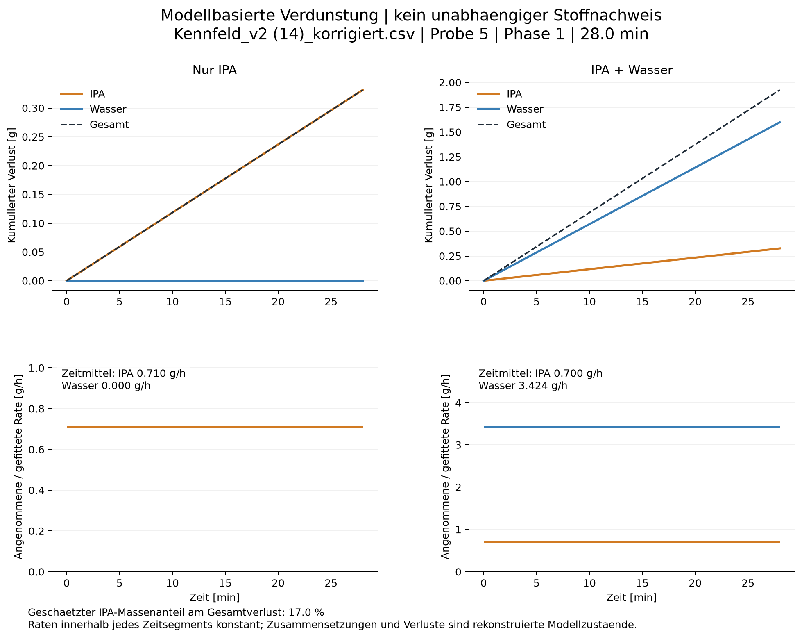
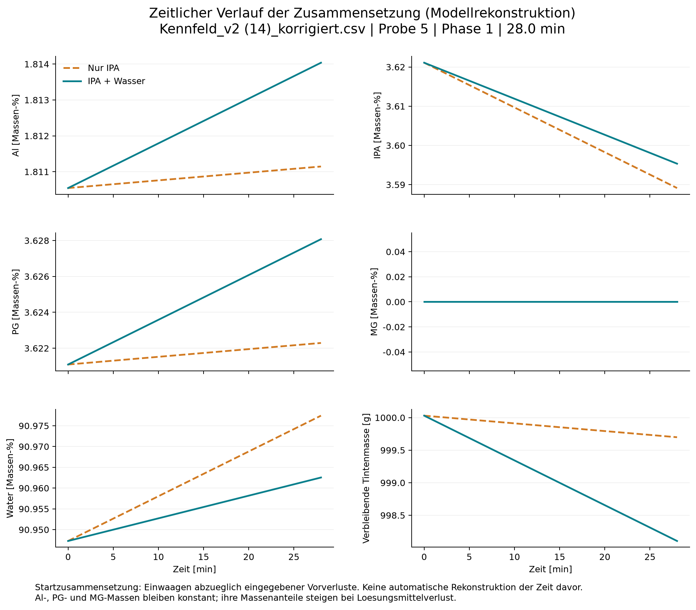
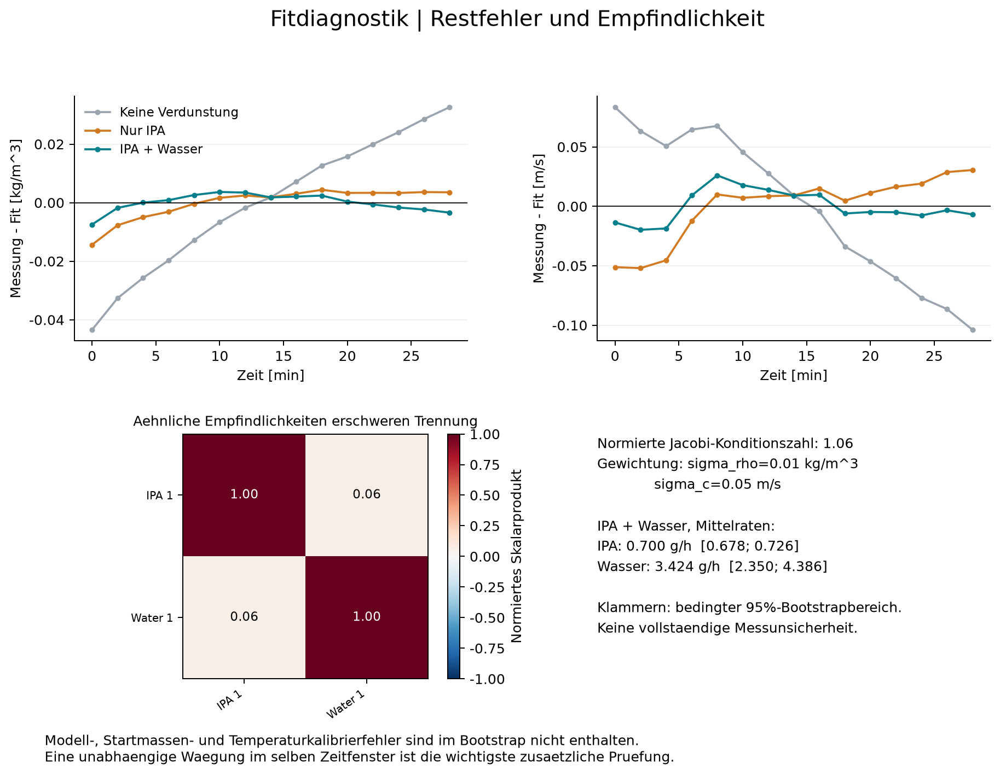

# Evaporation analysis

Source: Kennfeld_v2 (14)_korrigiert.csv
Sample: 5; phase: 1; duration: 28.00 min

| Model | IPA [g/h] | Water [g/h] | Total [g/h] | Density RMSE [kg/m^3] | Sound RMSE [m/s] |
|---|---:|---:|---:|---:|---:|
| none | 0.0000 | 0.0000 | 0.0000 | 0.0224 | 0.0613 |
| ipa | 0.7104 | 0.0000 | 0.7104 | 0.0052 | 0.0266 |
| mixed | 0.7000 | 3.4242 | 4.1242 | 0.0029 | 0.0131 |

## Interpretation and limitations

- Model-based estimates, not a direct measurement of vapour composition.
- Only losses after the first retained timestamp are fitted.
- Nominal additions minus entered prior losses define the starting composition.
- Al, PG and MG are assumed nonvolatile; no withdrawals, spills or unrecorded additions.
- A constant offset per sensor is fitted. Time-/composition-/temperature-dependent errors remain confounded.
- Bootstrap ranges are conditional on this calculator and the assumed initial composition.
- Stabil/Gueltig are not default filters because real evaporation itself can create a trend.
- Window shorter than one hour: small drifts and settling can dominate evaporation estimates.
- Unknown prior evaporation: zero prior losses were assumed for at least one solvent.
- Few timestamps: bootstrap uncertainty and residual diagnostics have limited reliability.
- A better two-solvent fit alone is not proof that water evaporated: the model has extra free parameters.
- Calculator support: IPA sound: temperature 25.0 C is outside locally supported anchors 18-25 C at 7.4 wt%.
- Calculator support: IPA sound: temperature 25.1 C is outside locally supported anchors 18-25 C at 7.3 wt%.
- Calculator support: IPA sound: temperature 25.1 C is outside locally supported anchors 18-25 C at 7.4 wt%.
- Calculator support: PG density: temperature 24.96 C is outside the locally supported temperature range.
- Calculator support: PG density: temperature 24.97 C is outside the locally supported temperature range.
- Calculator support: PG density: temperature 24.98 C is outside the locally supported temperature range.
- Calculator support: PG density: temperature 25.00 C is outside the locally supported temperature range.
- Calculator support: PG sound: temperature 25.0 C is outside locally supported anchors 25-65 C at 7.4 wt%.

The solvent ratio is a MASS ratio of the integrated inferred losses, not a volume or molar ratio.
All losses start at the first retained timestamp. Do not extrapolate them back before that point.
RMSE values refer to an in-sample fit with fitted channel offsets, not external validation.

