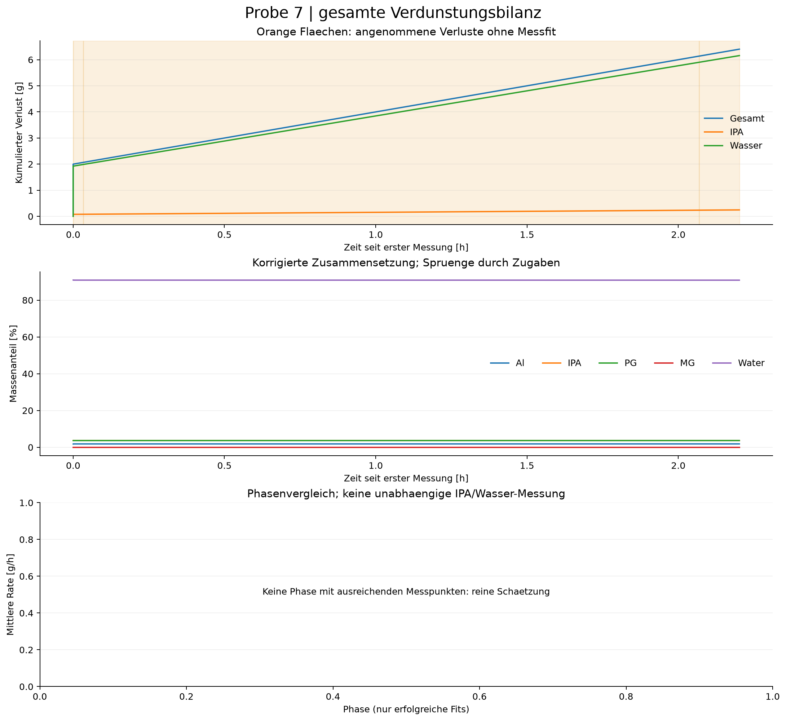

# Gesamtprobe: fortlaufende Verdunstungsbilanz

Probe 7 | Kennfeld_v2 (18)_korrigiert.csv

Gesamtverlust einschliesslich Vorverlust: **6.403 g**
- Vor der ersten Messung eingegeben: 2.000 g
- Seit der ersten Messung: 4.403 g
- In Messfenstern angepasst: 0.000 g
- Seit Messbeginn in ungemessenen Zeiten angenommen: 4.403 g
- IPA: 0.246 g; Wasser: 6.157 g (modell-/annahmenabhaengig)
- Ausgewerteter Zeitraum ab erster Messung: 2.202 h
- Auswertbare Phasen: 0 von 2

## Annahmen und Interpretation

- Fortlaufende, sequenzielle Modellbilanz; keine direkte chemische Verdunstungsmessung.
- Einwaagen sind kumulative Zugaben. Al/PG/MG gelten als nichtfluechtig; Entnahmen und Verschleppung sind nicht korrigiert.
- Der eingegebene Gesamtverlust vor Messbeginn wird genau einmal als Anfangskorrektur angesetzt; seine Dauer wird nicht aus den Messdaten abgeleitet.
- Rezepturzugaben werden am ersten Rohzeitstempel der neuen Rezeptur eingebucht; der reale Zugabezeitpunkt in einer Pause ist unbekannt.
- Ungemessene Zeiten (auch ausgeschlossene Randpunkte/zu kurze Phasen) werden separat geschaetzt.
- previous setzt die letzte Segmentrate des letzten erfolgreichen Fits fort; bis dahin gilt gap-rate.
- IPA/Wasser-Anteile ungemessener Verluste sind Annahmen. Ohne Vorgabe gilt der aktuelle IPA-Anteil am IPA/Wasser-Vorrat, kein Dampfdruckmodell.
- Jede Phase hat eigene Sensoroffsets. Spruenge zwischen Rezepturen identifizieren deshalb keinen eindeutigen Pausenverlust.
- Phasen-Bootstrap ist bedingt auf die uebernommene Startmasse. Unsicherheit vorheriger Fits, Pausen und Vorverlust wird NICHT propagiert; kein Gesamt-Konfidenzintervall.
- Ratenunterschiede nach Zugaben sind beschreibend, kein kausaler Nachweis eines Zusammensetzungseffekts.
- Die Bilanz umfasst die gewaehlte CSV bis zum letzten Rohzeitstempel, nicht automatisch andere Dateien derselben Probe.
- Phase 1: 2 brauchbare Punkte / unzureichende Segmentabdeckung; gesamte Dauer nur geschaetzt.
- Lange Pause vor Phase 2: 2.04 h, Methode constant_fallback_before_first_fit. Lagerbedingungen pruefen.
- Phase 2: 5 brauchbare Punkte / unzureichende Segmentabdeckung; gesamte Dauer nur geschaetzt.
- KEIN ERFOLGREICHER MESSFIT: Das gesamte Ergebnis beruht nur auf den vorgegebenen Annahmen.

## Ausgabedateien

- sample_loss_ledger.csv: lueckenlose Zeitbilanz, getrennt nach Fit und Annahme.
- sample_time_series.csv: kumulierte Verluste, verbleibende Massen, Anteile und Sensorresiduen.
- sample_transitions.csv: Zugaben, uebernommene Verluste und Abweichung zur Nominalrezeptur.
- sample_phases.csv: Phasenraten und Aenderung gegenueber dem letzten erfolgreichen Fit.
- analysis_metadata.json: Parameter, Quellenpruefsummen, Diagnostik und bedingte Phasen-Bootstraps.

Fuer Sensitivitaet erneut mit --gap-mode zero bzw. constant und unterschiedlichen
--assumed-ipa-fraction-Werten starten. Unterschiede sind Szenariospannen, keine Konfidenzintervalle.

