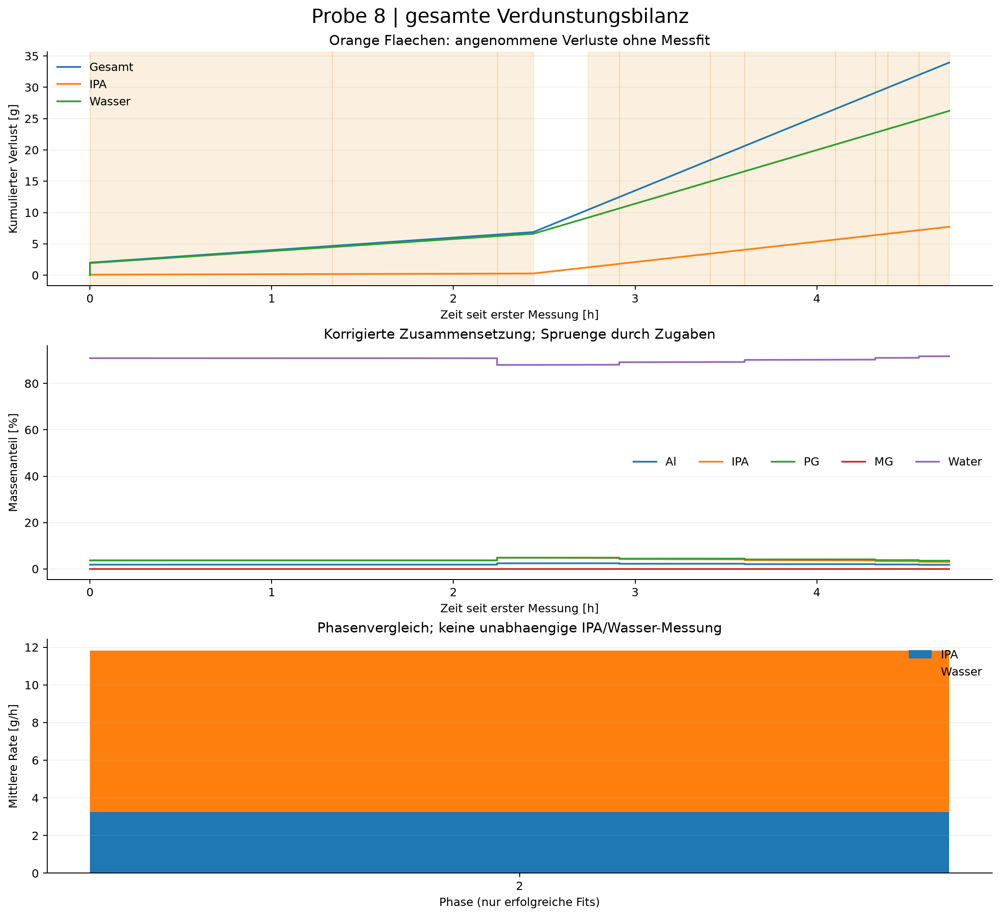

# Gesamtprobe: fortlaufende Verdunstungsbilanz

Probe 8 | Kennfeld_v2 (18)_korrigiert.csv

Gesamtverlust einschliesslich Vorverlust: **33.953 g**
- Vor der ersten Messung eingegeben: 2.000 g
- Seit der ersten Messung: 31.953 g
- In Messfenstern angepasst: 3.549 g
- Seit Messbeginn in ungemessenen Zeiten angenommen: 28.405 g
- IPA: 7.721 g; Wasser: 26.233 g (modell-/annahmenabhaengig)
- Ausgewerteter Zeitraum ab erster Messung: 4.729 h
- Auswertbare Phasen: 1 von 6

## Annahmen und Interpretation

- Fortlaufende, sequenzielle Modellbilanz; keine direkte chemische Verdunstungsmessung.
- Einwaagen sind kumulative Zugaben. Al/PG/MG gelten als nichtfluechtig; Entnahmen und Verschleppung sind nicht korrigiert.
- Der eingegebene Gesamtverlust vor Messbeginn wird genau einmal als Anfangskorrektur angesetzt; seine Dauer wird nicht aus den Messdaten abgeleitet.
- Rezepturzugaben werden am ersten Rohzeitstempel der neuen Rezeptur eingebucht; der reale Zugabezeitpunkt in einer Pause ist unbekannt.
- Ungemessene Zeiten (auch ausgeschlossene Randpunkte/zu kurze Phasen) werden separat geschaetzt.
- previous setzt die letzte Segmentrate des letzten erfolgreichen Fits fort; bis dahin gilt gap-rate.
- IPA/Wasser-Anteile ungemessener Verluste sind Annahmen. Ohne Vorgabe gilt der aktuelle IPA-Anteil am IPA/Wasser-Vorrat, kein Dampfdruckmodell.
- Jede Phase hat eigene Sensoroffsets. Spruenge zwischen Rezepturen identifizieren deshalb keinen eindeutigen Pausenverlust.
- Phasen-Bootstrap ist bedingt auf die uebernommene Startmasse. Unsicherheit vorheriger Fits, Pausen und Vorverlust wird NICHT propagiert; kein Gesamt-Konfidenzintervall.
- Ratenunterschiede nach Zugaben sind beschreibend, kein kausaler Nachweis eines Zusammensetzungseffekts.
- Die Bilanz umfasst die gewaehlte CSV bis zum letzten Rohzeitstempel, nicht automatisch andere Dateien derselben Probe.
- Phase 1: 2 brauchbare Punkte / unzureichende Segmentabdeckung; gesamte Dauer nur geschaetzt.
- Phase 2: IPA sound: temperature 24.3 C is outside locally supported anchors 25-25 C at 9.8 wt%.
- Phase 2: IPA sound: temperature 24.4 C is outside locally supported anchors 25-25 C at 9.8 wt%.
- Phase 2: IPA sound: temperature-slope curve has an internal gap of inf wt% near 9.8 wt%.
- Phase 2: PG density: temperature 24.25 C is outside the locally supported temperature range.
- Phase 2: PG density: temperature 24.29 C is outside the locally supported temperature range.
- Phase 2: PG density: temperature 24.33 C is outside the locally supported temperature range.
- Phase 2: PG density: temperature 24.34 C is outside the locally supported temperature range.
- Phase 2: PG density: temperature 24.35 C is outside the locally supported temperature range.
- Phase 2: PG density: temperature 24.36 C is outside the locally supported temperature range.
- Phase 2: PG density: temperature 24.37 C is outside the locally supported temperature range.
- Phase 2: PG density: temperature 24.38 C is outside the locally supported temperature range.
- Phase 2: PG sound: temperature 24.3 C is outside locally supported anchors 25-65 C at 9.8 wt%.
- Phase 2: PG sound: temperature 24.4 C is outside locally supported anchors 25-65 C at 9.8 wt%.
- Phase 3: 3 brauchbare Punkte / unzureichende Segmentabdeckung; gesamte Dauer nur geschaetzt.
- Phase 4: 2 brauchbare Punkte / unzureichende Segmentabdeckung; gesamte Dauer nur geschaetzt.
- Phase 5: 3 brauchbare Punkte / unzureichende Segmentabdeckung; gesamte Dauer nur geschaetzt.
- Phase 6: 6 brauchbare Punkte / unzureichende Segmentabdeckung; gesamte Dauer nur geschaetzt.

## Ausgabedateien

- sample_loss_ledger.csv: lueckenlose Zeitbilanz, getrennt nach Fit und Annahme.
- sample_time_series.csv: kumulierte Verluste, verbleibende Massen, Anteile und Sensorresiduen.
- sample_transitions.csv: Zugaben, uebernommene Verluste und Abweichung zur Nominalrezeptur.
- sample_phases.csv: Phasenraten und Aenderung gegenueber dem letzten erfolgreichen Fit.
- analysis_metadata.json: Parameter, Quellenpruefsummen, Diagnostik und bedingte Phasen-Bootstraps.

Fuer Sensitivitaet erneut mit --gap-mode zero bzw. constant und unterschiedlichen
--assumed-ipa-fraction-Werten starten. Unterschiede sind Szenariospannen, keine Konfidenzintervalle.

