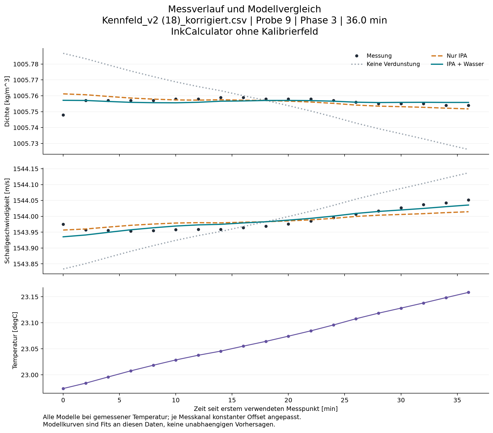
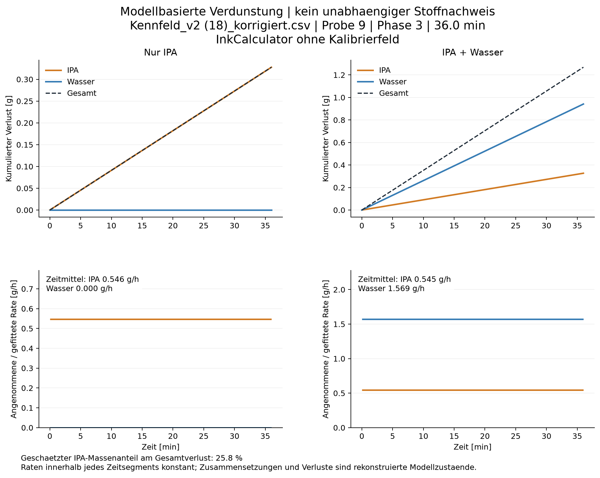
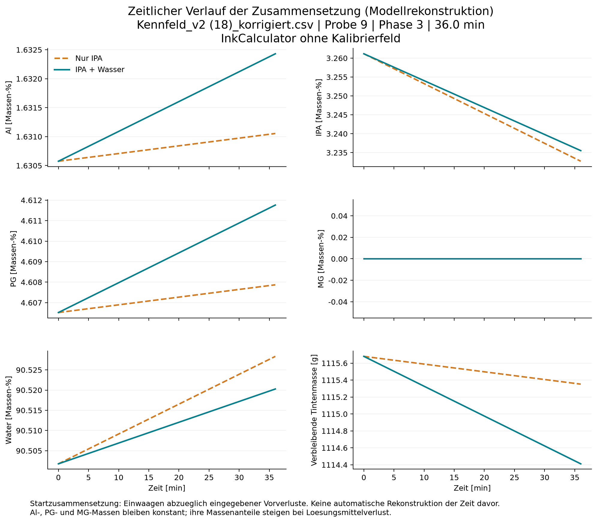
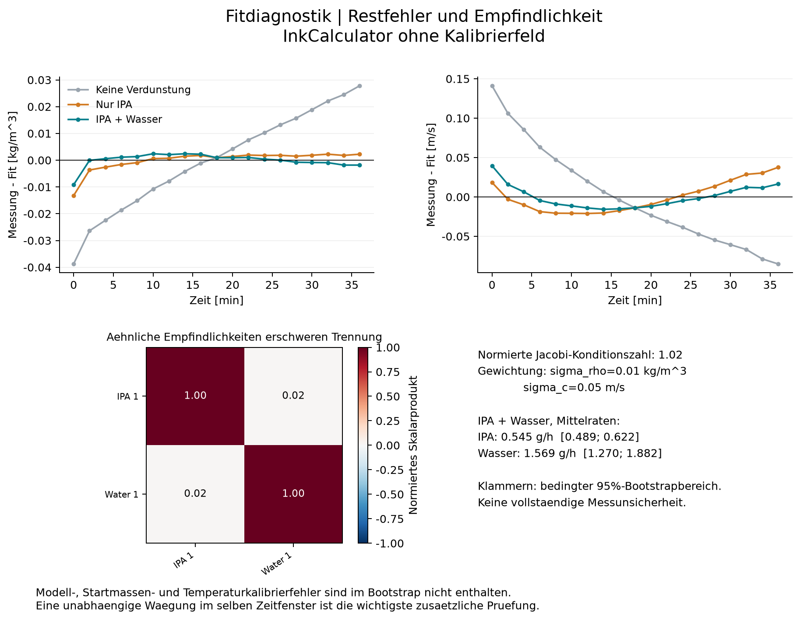

# Evaporation analysis

Source: Kennfeld_v2 (18)_korrigiert.csv
Sample: 9; phase: 3; duration: 36.00 min

Prediction model: InkCalculator ohne Kalibrierfeld
Calibration field: none

| Model | IPA [g/h] | Water [g/h] | Total [g/h] | Density RMSE [kg/m^3] | Sound RMSE [m/s] |
|---|---:|---:|---:|---:|---:|
| none | 0.0000 | 0.0000 | 0.0000 | 0.0182 | 0.0633 |
| ipa | 0.5462 | 0.0000 | 0.5462 | 0.0035 | 0.0191 |
| mixed | 0.5448 | 1.5691 | 2.1139 | 0.0025 | 0.0141 |

## Interpretation and limitations

- Model-based estimates, not a direct measurement of vapour composition.
- Only losses after the first retained timestamp are fitted.
- Nominal additions minus entered prior losses define the starting composition.
- Al, PG and MG are assumed nonvolatile; no withdrawals, spills or unrecorded additions.
- A constant offset per sensor is fitted. Time-/composition-/temperature-dependent errors remain confounded.
- Bootstrap ranges are conditional on this calculator and the assumed initial composition.
- Stabil/Gueltig are not default filters because real evaporation itself can create a trend.
- Window shorter than one hour: small drifts and settling can dominate evaporation estimates.
- Unknown prior evaporation: zero prior losses were assumed for at least one solvent.
- Few timestamps: bootstrap uncertainty and residual diagnostics have limited reliability.
- A better two-solvent fit alone is not proof that water evaporated: the model has extra free parameters.
- Calculator support: PG density: temperature 22.97 C is outside the locally supported temperature range.
- Calculator support: PG density: temperature 22.98 C is outside the locally supported temperature range.
- Calculator support: PG density: temperature 23.00 C is outside the locally supported temperature range.
- Calculator support: PG density: temperature 23.01 C is outside the locally supported temperature range.
- Calculator support: PG density: temperature 23.02 C is outside the locally supported temperature range.
- Calculator support: PG density: temperature 23.03 C is outside the locally supported temperature range.
- Calculator support: PG density: temperature 23.04 C is outside the locally supported temperature range.
- Calculator support: PG density: temperature 23.05 C is outside the locally supported temperature range.
- Calculator support: PG density: temperature 23.06 C is outside the locally supported temperature range.
- Calculator support: PG density: temperature 23.07 C is outside the locally supported temperature range.
- Calculator support: PG density: temperature 23.08 C is outside the locally supported temperature range.
- Calculator support: PG density: temperature 23.10 C is outside the locally supported temperature range.
- Calculator support: PG density: temperature 23.11 C is outside the locally supported temperature range.
- Calculator support: PG density: temperature 23.12 C is outside the locally supported temperature range.
- Calculator support: PG density: temperature 23.13 C is outside the locally supported temperature range.
- Calculator support: PG density: temperature 23.14 C is outside the locally supported temperature range.
- Calculator support: PG density: temperature 23.15 C is outside the locally supported temperature range.
- Calculator support: PG density: temperature 23.16 C is outside the locally supported temperature range.
- Calculator support: PG sound: temperature 23.0 C is outside locally supported anchors 25-65 C at 8.0 wt%.
- Calculator support: PG sound: temperature 23.1 C is outside locally supported anchors 25-65 C at 8.0 wt%.
- Calculator support: PG sound: temperature 23.2 C is outside locally supported anchors 25-65 C at 8.0 wt%.

The solvent ratio is a MASS ratio of the integrated inferred losses, not a volume or molar ratio.
All losses start at the first retained timestamp. Do not extrapolate them back before that point.
RMSE values refer to an in-sample fit with fitted channel offsets, not external validation.

CSV: *_physics contains the uncorrected calculator prediction; *_base_prediction contains physics + A(w) when a field is selected.
*_fit_with_offset additionally includes the fitted constant channel offset. Field spread is not a confidence interval on the evaporation rate.

