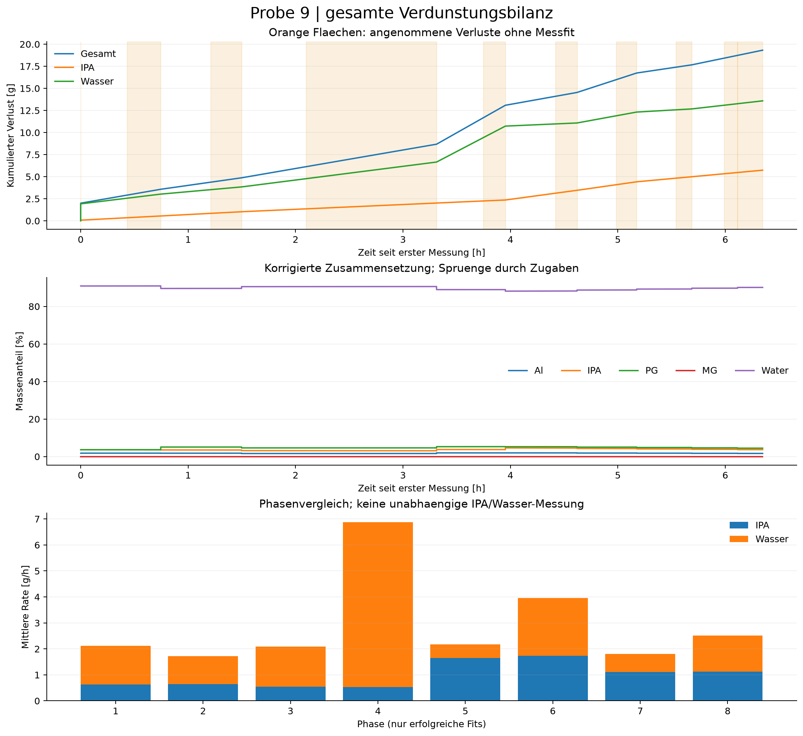

# Gesamtprobe: fortlaufende Verdunstungsbilanz

Probe 9 | Kennfeld_v2 (21)_korrigiert.csv

Gesamtverlust einschliesslich Vorverlust: **19.320 g**
- Vor der ersten Messung eingegeben: 2.000 g
- Seit der ersten Messung: 17.320 g
- In Messfenstern angepasst: 9.845 g
- Seit Messbeginn in ungemessenen Zeiten angenommen: 7.475 g
- IPA: 5.735 g; Wasser: 13.585 g (modell-/annahmenabhaengig)
- Ausgewerteter Zeitraum ab erster Messung: 6.348 h
- Auswertbare Phasen: 8 von 9

## Annahmen und Interpretation

- Fortlaufende, sequenzielle Modellbilanz; keine direkte chemische Verdunstungsmessung.
- Einwaagen sind kumulative Zugaben. Al/PG/MG gelten als nichtfluechtig; Entnahmen und Verschleppung sind nicht korrigiert.
- Der eingegebene Gesamtverlust vor Messbeginn wird genau einmal als Anfangskorrektur angesetzt; seine Dauer wird nicht aus den Messdaten abgeleitet.
- Rezepturzugaben werden am ersten Rohzeitstempel der neuen Rezeptur eingebucht; der reale Zugabezeitpunkt in einer Pause ist unbekannt.
- Ungemessene Zeiten (auch ausgeschlossene Randpunkte/zu kurze Phasen) werden separat geschaetzt.
- previous setzt die letzte Segmentrate des letzten erfolgreichen Fits fort; bis dahin gilt gap-rate.
- IPA/Wasser-Anteile ungemessener Verluste sind Annahmen. Ohne Vorgabe gilt der aktuelle IPA-Anteil am IPA/Wasser-Vorrat, kein Dampfdruckmodell.
- Jede Phase hat eigene Sensoroffsets. Spruenge zwischen Rezepturen identifizieren deshalb keinen eindeutigen Pausenverlust.
- Phasen-Bootstrap ist bedingt auf die uebernommene Startmasse. Unsicherheit vorheriger Fits, Pausen und Vorverlust wird NICHT propagiert; kein Gesamt-Konfidenzintervall.
- Ratenunterschiede nach Zugaben sind beschreibend, kein kausaler Nachweis eines Zusammensetzungseffekts.
- Die Bilanz umfasst die gewaehlte CSV bis zum letzten Rohzeitstempel, nicht automatisch andere Dateien derselben Probe.
- Phase 1: PG density: temperature 22.40 C is outside the locally supported temperature range.
- Phase 1: PG density: temperature 22.42 C is outside the locally supported temperature range.
- Phase 1: PG density: temperature 22.44 C is outside the locally supported temperature range.
- Phase 1: PG density: temperature 22.46 C is outside the locally supported temperature range.
- Phase 1: PG density: temperature 22.47 C is outside the locally supported temperature range.
- Phase 1: PG density: temperature 22.48 C is outside the locally supported temperature range.
- Phase 1: PG density: temperature 22.50 C is outside the locally supported temperature range.
- Phase 1: PG density: temperature 22.51 C is outside the locally supported temperature range.
- Phase 1: PG density: temperature 22.52 C is outside the locally supported temperature range.
- Phase 1: PG density: temperature 22.54 C is outside the locally supported temperature range.
- Phase 1: PG density: temperature 22.55 C is outside the locally supported temperature range.
- Phase 1: PG density: temperature 22.56 C is outside the locally supported temperature range.
- Phase 1: PG density: temperature 22.57 C is outside the locally supported temperature range.
- Phase 1: PG density: temperature 22.59 C is outside the locally supported temperature range.
- Phase 1: PG sound: temperature 22.4 C is outside locally supported anchors 25-65 C at 7.4 wt%.
- Phase 1: PG sound: temperature 22.5 C is outside locally supported anchors 25-65 C at 7.4 wt%.
- Phase 1: PG sound: temperature 22.6 C is outside locally supported anchors 25-65 C at 7.4 wt%.
- Phase 2: PG density: temperature 22.84 C is outside the locally supported temperature range.
- Phase 2: PG density: temperature 22.85 C is outside the locally supported temperature range.
- Phase 2: PG density: temperature 22.86 C is outside the locally supported temperature range.
- Phase 2: PG density: temperature 22.87 C is outside the locally supported temperature range.
- Phase 2: PG density: temperature 22.88 C is outside the locally supported temperature range.
- Phase 2: PG density: temperature 22.89 C is outside the locally supported temperature range.
- Phase 2: PG density: temperature 22.90 C is outside the locally supported temperature range.
- Phase 2: PG sound: temperature 22.8 C is outside locally supported anchors 25-65 C at 8.8 wt%.
- Phase 2: PG sound: temperature 22.9 C is outside locally supported anchors 25-65 C at 8.8 wt%.
- Phase 3: PG density: temperature 22.97 C is outside the locally supported temperature range.
- Phase 3: PG density: temperature 22.98 C is outside the locally supported temperature range.
- Phase 3: PG density: temperature 23.00 C is outside the locally supported temperature range.
- Phase 3: PG density: temperature 23.01 C is outside the locally supported temperature range.
- Phase 3: PG density: temperature 23.02 C is outside the locally supported temperature range.
- Phase 3: PG density: temperature 23.03 C is outside the locally supported temperature range.
- Phase 3: PG density: temperature 23.04 C is outside the locally supported temperature range.
- Phase 3: PG density: temperature 23.05 C is outside the locally supported temperature range.
- Phase 3: PG density: temperature 23.06 C is outside the locally supported temperature range.
- Phase 3: PG density: temperature 23.07 C is outside the locally supported temperature range.
- Phase 3: PG density: temperature 23.08 C is outside the locally supported temperature range.
- Phase 3: PG density: temperature 23.10 C is outside the locally supported temperature range.
- Phase 3: PG density: temperature 23.11 C is outside the locally supported temperature range.
- Phase 3: PG density: temperature 23.12 C is outside the locally supported temperature range.
- Phase 3: PG density: temperature 23.13 C is outside the locally supported temperature range.
- Phase 3: PG density: temperature 23.14 C is outside the locally supported temperature range.
- Phase 3: PG density: temperature 23.15 C is outside the locally supported temperature range.
- Phase 3: PG density: temperature 23.16 C is outside the locally supported temperature range.
- Phase 3: PG sound: temperature 23.0 C is outside locally supported anchors 25-65 C at 7.9 wt%.
- Phase 3: PG sound: temperature 23.1 C is outside locally supported anchors 25-65 C at 7.9 wt%.
- Phase 3: PG sound: temperature 23.2 C is outside locally supported anchors 25-65 C at 7.9 wt%.
- Lange Pause vor Phase 4: 1.22 h, Methode previous_fitted_terminal_rates. Lagerbedingungen pruefen.
- Phase 4: PG density: temperature 23.15 C is outside the locally supported temperature range.
- Phase 4: PG density: temperature 23.20 C is outside the locally supported temperature range.
- Phase 4: PG density: temperature 23.23 C is outside the locally supported temperature range.
- Phase 4: PG density: temperature 23.27 C is outside the locally supported temperature range.
- Phase 4: PG density: temperature 23.30 C is outside the locally supported temperature range.
- Phase 4: PG density: temperature 23.33 C is outside the locally supported temperature range.
- Phase 4: PG density: temperature 23.36 C is outside the locally supported temperature range.
- Phase 4: PG density: temperature 23.39 C is outside the locally supported temperature range.
- Phase 4: PG density: temperature 23.42 C is outside the locally supported temperature range.
- Phase 4: PG density: temperature 23.44 C is outside the locally supported temperature range.
- Phase 4: PG density: temperature 23.47 C is outside the locally supported temperature range.
- Phase 4: PG density: temperature 23.49 C is outside the locally supported temperature range.
- Phase 4: PG density: temperature 23.51 C is outside the locally supported temperature range.
- Phase 4: PG density: temperature 23.54 C is outside the locally supported temperature range.
- Phase 4: PG sound: temperature 23.2 C is outside locally supported anchors 25-65 C at 9.2 wt%.
- Phase 4: PG sound: temperature 23.3 C is outside locally supported anchors 25-65 C at 9.2 wt%.
- Phase 4: PG sound: temperature 23.4 C is outside locally supported anchors 25-65 C at 9.2 wt%.
- Phase 4: PG sound: temperature 23.5 C is outside locally supported anchors 25-65 C at 9.2 wt%.
- Phase 5: IPA sound: temperature 23.9 C is outside locally supported anchors 25-25 C at 10.0 wt%.
- Phase 5: IPA sound: temperature 23.9 C is outside locally supported anchors 25-25 C at 10.1 wt%.
- Phase 5: IPA sound: temperature 24.0 C is outside locally supported anchors 25-25 C at 10.0 wt%.
- Phase 5: IPA sound: temperature-slope curve has an internal gap of inf wt% near 10.0 wt%.
- Phase 5: IPA sound: temperature-slope curve has an internal gap of inf wt% near 10.1 wt%.
- Phase 5: PG density: temperature 23.86 C is outside the locally supported temperature range.
- Phase 5: PG density: temperature 23.87 C is outside the locally supported temperature range.
- Phase 5: PG density: temperature 23.88 C is outside the locally supported temperature range.
- Phase 5: PG density: temperature 23.89 C is outside the locally supported temperature range.
- Phase 5: PG density: temperature 23.90 C is outside the locally supported temperature range.
- Phase 5: PG density: temperature 23.91 C is outside the locally supported temperature range.
- Phase 5: PG density: temperature 23.93 C is outside the locally supported temperature range.
- Phase 5: PG density: temperature 23.94 C is outside the locally supported temperature range.
- Phase 5: PG density: temperature 23.95 C is outside the locally supported temperature range.
- Phase 5: PG density: temperature 23.96 C is outside the locally supported temperature range.
- Phase 5: PG density: temperature 23.97 C is outside the locally supported temperature range.
- Phase 5: PG density: temperature 23.98 C is outside the locally supported temperature range.
- Phase 5: PG sound: temperature 23.9 C is outside locally supported anchors 25-65 C at 10.0 wt%.
- Phase 5: PG sound: temperature 23.9 C is outside locally supported anchors 25-65 C at 10.1 wt%.
- Phase 5: PG sound: temperature 24.0 C is outside locally supported anchors 25-65 C at 10.0 wt%.
- Phase 6: PG density: temperature 24.04 C is outside the locally supported temperature range.
- Phase 6: PG density: temperature 24.06 C is outside the locally supported temperature range.
- Phase 6: PG density: temperature 24.07 C is outside the locally supported temperature range.
- Phase 6: PG density: temperature 24.08 C is outside the locally supported temperature range.
- Phase 6: PG density: temperature 24.10 C is outside the locally supported temperature range.
- Phase 6: PG density: temperature 24.11 C is outside the locally supported temperature range.
- Phase 6: PG density: temperature 24.13 C is outside the locally supported temperature range.
- Phase 6: PG density: temperature 24.14 C is outside the locally supported temperature range.
- Phase 6: PG density: temperature 24.15 C is outside the locally supported temperature range.
- Phase 6: PG density: temperature 24.16 C is outside the locally supported temperature range.
- Phase 6: PG density: temperature 24.17 C is outside the locally supported temperature range.
- Phase 6: PG density: temperature 24.18 C is outside the locally supported temperature range.
- Phase 6: PG sound: temperature 24.0 C is outside locally supported anchors 25-65 C at 9.6 wt%.
- Phase 6: PG sound: temperature 24.1 C is outside locally supported anchors 25-65 C at 9.5 wt%.
- Phase 6: PG sound: temperature 24.1 C is outside locally supported anchors 25-65 C at 9.6 wt%.
- Phase 6: PG sound: temperature 24.2 C is outside locally supported anchors 25-65 C at 9.5 wt%.
- Phase 7: PG density: temperature 24.22 C is outside the locally supported temperature range.
- Phase 7: PG density: temperature 24.24 C is outside the locally supported temperature range.
- Phase 7: PG density: temperature 24.26 C is outside the locally supported temperature range.
- Phase 7: PG density: temperature 24.28 C is outside the locally supported temperature range.
- Phase 7: PG density: temperature 24.30 C is outside the locally supported temperature range.
- Phase 7: PG density: temperature 24.31 C is outside the locally supported temperature range.
- Phase 7: PG density: temperature 24.33 C is outside the locally supported temperature range.
- Phase 7: PG density: temperature 24.35 C is outside the locally supported temperature range.
- Phase 7: PG density: temperature 24.36 C is outside the locally supported temperature range.
- Phase 7: PG density: temperature 24.38 C is outside the locally supported temperature range.
- Phase 7: PG density: temperature 24.39 C is outside the locally supported temperature range.
- Phase 7: PG density: temperature 24.40 C is outside the locally supported temperature range.
- Phase 7: PG sound: temperature 24.2 C is outside locally supported anchors 25-65 C at 9.1 wt%.
- Phase 7: PG sound: temperature 24.3 C is outside locally supported anchors 25-65 C at 9.1 wt%.
- Phase 7: PG sound: temperature 24.4 C is outside locally supported anchors 25-65 C at 9.1 wt%.
- Phase 8: PG density: temperature 24.41 C is outside the locally supported temperature range.
- Phase 8: PG density: temperature 24.42 C is outside the locally supported temperature range.
- Phase 8: PG density: temperature 24.43 C is outside the locally supported temperature range.
- Phase 8: PG density: temperature 24.44 C is outside the locally supported temperature range.
- Phase 8: PG density: temperature 24.46 C is outside the locally supported temperature range.
- Phase 8: PG density: temperature 24.48 C is outside the locally supported temperature range.
- Phase 8: PG density: temperature 24.49 C is outside the locally supported temperature range.
- Phase 8: PG density: temperature 24.50 C is outside the locally supported temperature range.
- Phase 8: PG density: temperature 24.52 C is outside the locally supported temperature range.
- Phase 8: PG density: temperature 24.53 C is outside the locally supported temperature range.
- Phase 8: PG sound: temperature 24.4 C is outside locally supported anchors 25-65 C at 8.7 wt%.
- Phase 8: PG sound: temperature 24.5 C is outside locally supported anchors 25-65 C at 8.7 wt%.
- Phase 9: 5 brauchbare Punkte / unzureichende Segmentabdeckung; gesamte Dauer nur geschaetzt.

## Ausgabedateien

- sample_loss_ledger.csv: lueckenlose Zeitbilanz, getrennt nach Fit und Annahme.
- sample_time_series.csv: kumulierte Verluste, verbleibende Massen, Anteile und Sensorresiduen.
- sample_transitions.csv: Zugaben, uebernommene Verluste und Abweichung zur Nominalrezeptur.
- sample_phases.csv: Phasenraten und Aenderung gegenueber dem letzten erfolgreichen Fit.
- analysis_metadata.json: Parameter, Quellenpruefsummen, Diagnostik und bedingte Phasen-Bootstraps.

Fuer Sensitivitaet erneut mit --gap-mode zero bzw. constant und unterschiedlichen
--assumed-ipa-fraction-Werten starten. Unterschiede sind Szenariospannen, keine Konfidenzintervalle.

