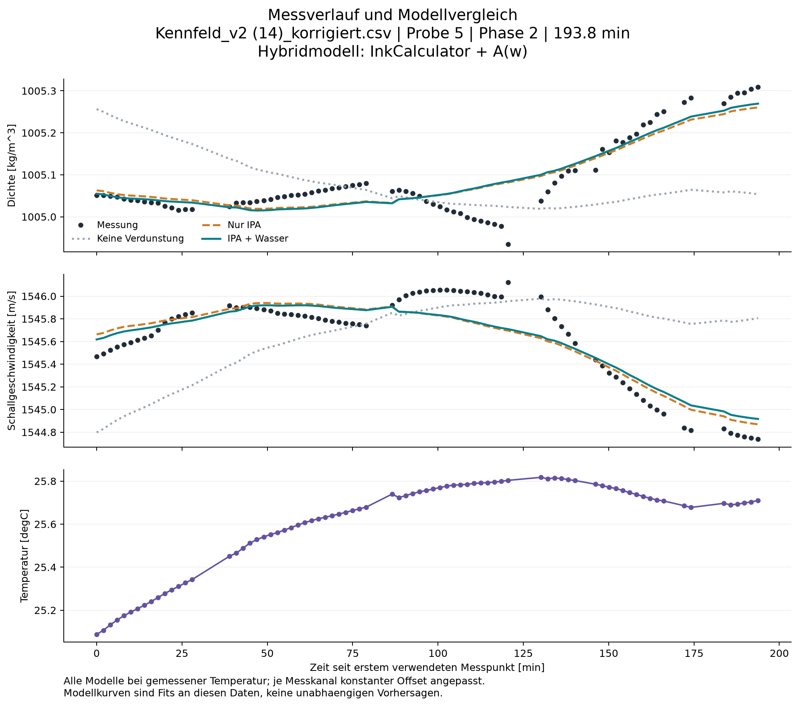
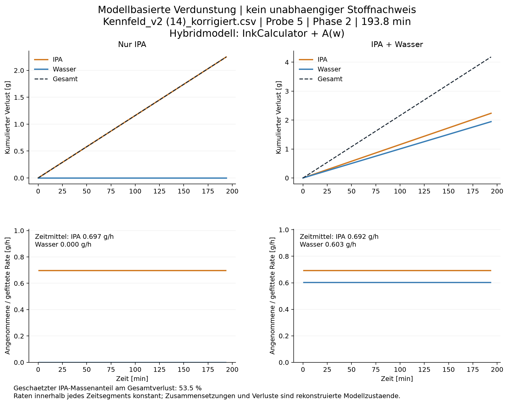
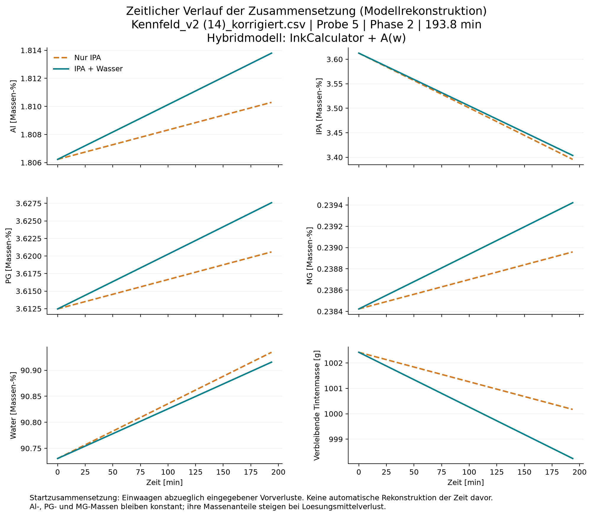
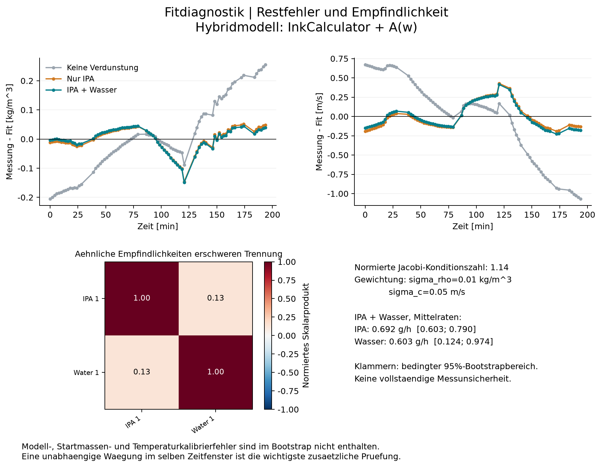

# Evaporation analysis

Source: Kennfeld_v2 (14)_korrigiert.csv
Sample: 5; phase: 2; duration: 193.77 min

Prediction model: Hybridmodell: InkCalculator + A(w)
Calibration field: C:\dev\masterarbeit\sim_par_ink_prop\laboratory_measurement_L-Com\results\calibration_field\probe_3__Kennfeld_v2_14__korrigiert__20260831_135330\calibration_field.json

| Model | IPA [g/h] | Water [g/h] | Total [g/h] | Density RMSE [kg/m^3] | Sound RMSE [m/s] |
|---|---:|---:|---:|---:|---:|
| none | 0.0000 | 0.0000 | 0.0000 | 0.1269 | 0.5216 |
| ipa | 0.6966 | 0.0000 | 0.6966 | 0.0398 | 0.1623 |
| mixed | 0.6922 | 0.6025 | 1.2947 | 0.0395 | 0.1602 |

## Interpretation and limitations

- Model-based estimates, not a direct measurement of vapour composition.
- Only losses after the first retained timestamp are fitted.
- Nominal additions minus entered prior losses define the starting composition.
- Al, PG and MG are assumed nonvolatile; no withdrawals, spills or unrecorded additions.
- A constant offset per sensor is fitted. Time-/composition-/temperature-dependent errors remain confounded.
- Bootstrap ranges are conditional on this calculator and the assumed initial composition.
- Stabil/Gueltig are not default filters because real evaporation itself can create a trend.
- Unknown prior evaporation: zero prior losses were assumed for at least one solvent.
- A better two-solvent fit alone is not proof that water evaporated: the model has extra free parameters.
- Calculator support: IPA sound: temperature 25.1 C is outside locally supported anchors 18-25 C at 7.4 wt%.
- Calculator support: IPA sound: temperature 25.2 C is outside locally supported anchors 18-25 C at 7.3 wt%.
- Calculator support: IPA sound: temperature 25.2 C is outside locally supported anchors 18-25 C at 7.4 wt%.
- Calculator support: IPA sound: temperature 25.3 C is outside locally supported anchors 18-25 C at 7.3 wt%.
- Calculator support: IPA sound: temperature 25.3 C is outside locally supported anchors 18-25 C at 7.4 wt%.
- Calculator support: IPA sound: temperature 25.5 C is outside locally supported anchors 18-25 C at 7.3 wt%.
- Calculator support: IPA sound: temperature 25.5 C is outside locally supported anchors 18-25 C at 7.4 wt%.
- Calculator support: IPA sound: temperature 25.6 C is outside locally supported anchors 18-25 C at 7.3 wt%.
- Calculator support: IPA sound: temperature 25.6 C is outside locally supported anchors 18-25 C at 7.4 wt%.
- Calculator support: IPA sound: temperature 25.7 C is outside locally supported anchors 18-25 C at 7.1 wt%.
- Calculator support: IPA sound: temperature 25.7 C is outside locally supported anchors 18-25 C at 7.2 wt%.
- Calculator support: IPA sound: temperature 25.7 C is outside locally supported anchors 18-25 C at 7.3 wt%.
- Calculator support: IPA sound: temperature 25.7 C is outside locally supported anchors 18-25 C at 7.4 wt%.
- Calculator support: IPA sound: temperature 25.8 C is outside locally supported anchors 18-25 C at 7.2 wt%.
- Calculator support: IPA sound: temperature 25.8 C is outside locally supported anchors 18-25 C at 7.3 wt%.
- Calculator support: IPA sound: temperature 25.8 C is outside locally supported anchors 18-25 C at 7.4 wt%.
- The field was built using inferred evaporation; its corrections depend on that previous evaporation assumption.
- Hybrid prediction: InkCalculator + saved A(w), reevaluated at every reconstructed composition.
- Constant channel offsets remain fitted; only composition-dependent changes of A(w) affect the loss-rate fit.
- The field is held fixed: bootstrap intervals exclude calibration-node, interpolation and calibration-evaporation uncertainty.
- Field coverage uses an axis-aligned bounding box only. Inside this box does not guarantee interpolation inside the sampled region.
- The field has no learned temperature dependence. A temperature-dependent residual drift can still mimic evaporation.
- IDW slopes are empirical, not thermodynamic derivatives; evaporation estimates require independent gravimetric checks.
- FIELD EXTRAPOLATION (none): 79/79 fitted states outside the bounding box; axes: MG, PG. No clipping or physics fallback applied.
- FIELD EXTRAPOLATION (ipa): 79/79 fitted states outside the bounding box; axes: MG, PG. No clipping or physics fallback applied.
- FIELD EXTRAPOLATION (mixed): 79/79 fitted states outside the bounding box; axes: MG, PG. No clipping or physics fallback applied.
- FIELD TEMPERATURE: measurements extend beyond calibration temperatures 22.18 to 22.87 degC.

The solvent ratio is a MASS ratio of the integrated inferred losses, not a volume or molar ratio.
All losses start at the first retained timestamp. Do not extrapolate them back before that point.
RMSE values refer to an in-sample fit with fitted channel offsets, not external validation.

CSV: *_physics contains the uncorrected calculator prediction; *_base_prediction contains physics + A(w) when a field is selected.
*_fit_with_offset additionally includes the fitted constant channel offset. Field spread is not a confidence interval on the evaporation rate.

