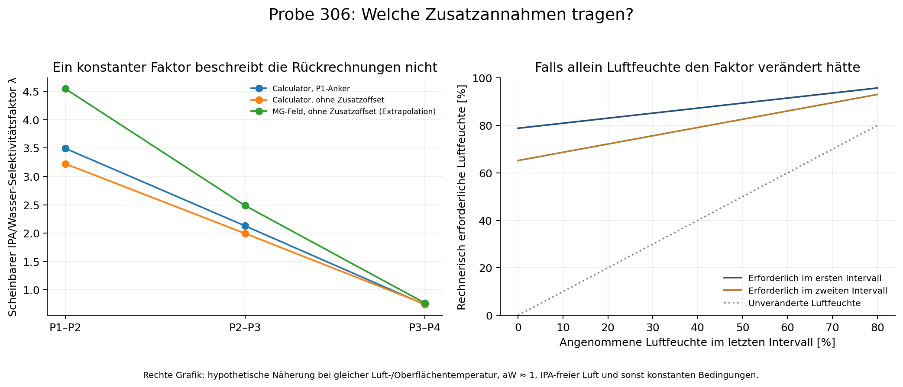

# Was können Luftfeuchte und Zusatzannahmen beitragen?

Die Luftfeuchte liefert eine zusätzliche Randbedingung für den Wasserverlust.
Sie bestimmt die Tintenzusammensetzung nicht allein. Die vorhandene Messdatei
enthält weder Luftfeuchte noch Lufttemperatur; T_M ist die Tintentemperatur am
Sensor. Die tatsächliche Temperatur der verdunstenden Oberfläche ist damit
ebenfalls nicht unabhängig gemessen.

## Physikalische Ergänzung

Als vereinfachtes Stoffübergangsmodell kann man schreiben:

R_W = K_W [a_W(w,T_s) p_W^sat(T_s) − φ p_W^sat(T_a)]

R_IPA = K_IPA [a_IPA(w,T_s) p_IPA^sat(T_s) − p_IPA,Luft]

R_i sind positive Nettomassenverlustraten, solange die Klammern positiv sind.
K_i sind effektive Faktoren mit Geometrie, Stoffübergang und Massenumrechnung.
φ ist RH/100, T_s die Oberflächentemperatur und T_a die Lufttemperatur.
a_i sind thermodynamische Aktivitäten (bei entsprechender Näherung γ_i x_i
mit **Molenanteilen** x_i, nicht direkt Massenprozenten).
Das Modell setzt eine ausreichend repräsentative, homogene Flüssigkeitsphase
und bekannte lokale Luftbedingungen voraus. Bei mehreren Verdunstungszonen
müssen deren Beiträge summiert werden.

Höhere Luftfeuchte vermindert bei sonst gleichen Bedingungen den Wasserverlust.
Damit verschiebt sie den momentanen Verlustanteil in Richtung IPA. Für dieselbe
Tintenzusammensetzung wird ein isothermer Anstieg von c dadurch schwerer erreicht.
Raumluftfeuchte ist bei erwärmter oder rezirkulierender Prozessluft nur eine
Randbedingung für die Zuluft; lokale Luft- und Oberflächentemperaturen sowie
Wasser- und IPA-Anreicherung der Prozessluft bleiben nötig.

Primärquellen für die Beziehungen:
[COMSOL: Moist Air Properties](https://doc.comsol.com/6.4/doc/com.comsol.help.heat/heat_ug_modeling.06.15.html),
[COMSOL: Evaporation and Condensation](https://doc.comsol.com/6.4/doc/com.comsol.help.chem/chem_ug_chemsptrans.08.289.html),
[COMSOL: Wasseraktivität und Gleichgewichtsdampfdruck](https://doc.comsol.com/6.4/doc/com.comsol.help.heat/heat_ug_mt_features.10.04.html).

## Prüfung einer einfachen Annahme an Probe 306

Ein empirisches Ersatzmodell lautet R_IPA/R_W = λ·w_IPA/w_W.
λ beschreibt die bevorzugte Verdunstung relativ zur aktuellen Massenverteilung;
es ist ein effektiver Prozessfaktor, keine reine Stoffkonstante.
Am isothermen stationären Punkt folgt daraus

w_IPA/w_W = 1 / [λ·r_krit(w,T)].

Sind λ und weitere Rezepturverhältnisse unabhängig bekannt, entsteht eine
zusätzliche Beziehung für die Rückrechnung. r_krit bleibt von der gesuchten
Zusammensetzung abhängig; die anfänglichen 17–18:1 dürfen dabei nicht überall
als Konstante eingesetzt werden. Bei veränderlicher Temperatur muss die volle
Bilanz dc/dt = D_W R_W + D_IPA R_IPA + (∂c/∂T) dT/dt benutzt werden.

Für ein innerhalb eines Intervalls konstantes λ gilt bei homogener Probenentnahme:

λ = ln[(m_IPA/m_Al)_2/(m_IPA/m_Al)_1] /
    ln[(m_W/m_Al)_2/(m_W/m_Al)_1].

Aus den vier rückgerechneten Zuständen von Probe 306 ergeben sich unter der
P1-Rezepturannahme λ ≈ 3.49, 2.13, 0.74.
Die anderen verwendbaren Modellvarianten zeigen dieselbe deutliche Abnahme.
Ein über den ganzen Tag unveränderter Faktor ist deshalb mit diesen
punktweisen Rückrechnungen nicht vereinbar. Die Faktoren sind aus denselben
Sensorwerten abgeleitet, keine unabhängige Validierung der Verdunstung.
Prozessänderungen, nichtideales Mischungsverhalten, IPA in der Prozessluft,
lokale Temperaturen sowie Mess-/Modellabweichungen können den effektiven
Faktor verändern. Die MG-Kalibrierfeldvariante extrapoliert; ein fehlerhafter
Fit der vierten Modellvariante wurde ausgeschlossen.

## Könnte allein Luftfeuchte diese Abnahme erklären?

Nur unter den starken Zusatzannahmen T_s = T_a, a_W ≈ 1, IPA-freie Umgebung,
unveränderte Aktivitäts-/Stoffübergangsfaktoren und je Intervall repräsentative
konstante Bedingungen gilt näherungsweise λ_app = λ_dry/(1−φ).

Dann müsste bei Probe 306 die Feuchte im ersten Intervall mindestens
78.8 % betragen, selbst wenn sie im letzten
Intervall auf 0 % gefallen wäre. Bei angenommenen 50 % im letzten Intervall
wären im ersten rund 89.4 % und im zweiten
82.6 % erforderlich.
Das sind **hypothetisch erforderliche Feuchten**, keine gemessenen oder
belastbar aus den Daten geschätzten Feuchten. Sie zeigen, dass eine nahezu
unveränderte Raumluftfeuchte den Faktorwechsel in diesem einfachen Modell
nicht erklärt. Gemessene Feuchteverläufe könnten diese Hypothese prüfen.

## Sinnvolle Annahmen für die weitere Eingrenzung

1. Bekannte Anfangsrezeptur und dokumentierte Zugaben/Entnahmen; Verluste vor
   P1 als eigene Unsicherheit führen.
2. Gut durchmischte Tinte und homogene Probenentnahme. Bei Probe 306 laut
   Protokoll kein Druckaustrag und keine dokumentierte Nachfüllung.
3. PG, Pigment und MG als im betrachteten Versuch zurückgehalten behandeln;
   das ist eine zu prüfende Annahme über die Komponentenbilanz.
4. Dichte und Schall bei gemessener Tintentemperatur auswerten und Sensoroffsets
   über eine bekannte Referenzmischung unabhängig bestimmen.
5. Prozessabschnitte mit vergleichbarer Luftführung, Trocknung und Temperatur
   gemeinsam beschreiben. λ an diesen Bedingungen kalibrieren, statt ein
   universelles λ für Probe 12 und 306 vorauszusetzen.
6. Zeitgleiche Festkörper- und mindestens einzelne unabhängige IPA-Messungen
   als Anker verwenden. Der Tankverlust ist erst nach Inventaränderungen und
   Probenentnahmen als Gesamtverdunstung nutzbar.

Probe 12 bleibt ein Beispiel für eine temperaturbedingte Rohsignalumkehr.
Bei Probe 306 bleibt die Umkehr auch nach der bisherigen Temperaturkorrektur
erhalten. Diese beiden Mechanismen müssen getrennt modelliert werden.

Die nächste quantitative Untersuchung sollte gemessene lokale Luftfeuchte,
Lufttemperatur und möglichst Oberflächentemperatur als Eingänge verwenden und
die übrigen unbekannten Größen als Parameterbereiche behandeln. Ohne diese
Messwerte können nur ausdrücklich hypothetische Szenarien gerechnet werden.
